```{r setup}
#| include: false
```

### **Questão 1: Diagrama de Lexis**

a\) Construir o Diagrama de Lexis para os dados de nascidos vivos de 2000 a 2024 da UF escolhida (SINASC) e de óbitos menores de 5 anos (idades simples) para o mesmo período segundo o ano de nascimento.

**Resposta:**

b\) Supondo população fechada (inexistência de migração), calcule a probabilidade de um recém-nascido na UF ou no território de escolha sobreviver à idade exata de 5 para as coortes de 2000 a 2019.

**Resposta:**

c\) Considerando o mesmo pressuposto, calcule a probabilidade de sobreviver ao primeiro aniversário dos recém-nascidos no período de 2000 a 2023.

**Resposta:**

d\) Para os anos de 2022 e 2023, calcule a probabilidade de morrer antes de completar o primeiro aniversário, segundo raça/cor (Desafio)

**Resposta:**

e\) Comente os valores encontrados. Não se esquecer da qualidade da informação trabalhada.

**Resposta:**

### **Questão 2: Natalidade/Fecundidade**

a\) Com base nos dados do SINASC, para cada um dos anos seguintes: 2010, 2019, 2021, 2022 e 2024, e na população por sexo e idade estimada (projetada), construa os seguintes indicadores para a Unidade da Federação (Use as projeções do IBGE - Revisão 2024) :

-   Taxa Bruta de Natalidade

-   Taxa Fecundidade Geral (TFG) e Taxas específicas de fecundidade - nfx (Grafique esses valores)

-   Taxa de Fecundidade Total (TFT) ou Índice Sintético de Fecundidade

-   Taxas específicas de fecundidade feminina (apenas os nascimentos femininos)

-   Taxa Bruta de Reprodução

-   Taxa Líquida de Reprodução (é necessária a informação da função L da Tábua de Vida)

**Resposta:**

$TBN = \frac{N}{P} \times 1000$

$TBN$: Taxa Bruta de Natalidade

$N$: Número total de nascidos vivos ocorridos no período

$P$: População média do período

```{r, echo=FALSE, out.width="70%", fig.align='center'}
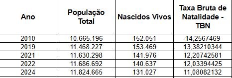
```

$TFG = \frac{N}{P_f} \times 1000$

$TFG$: Taxa de Fecundidade Geral

$N$: Número total de nascidos vivos ocorridos no período

$P_f$: População feminina média entre 15 e 49 anos

```{r, echo=FALSE, out.width="70%", fig.align='center'}
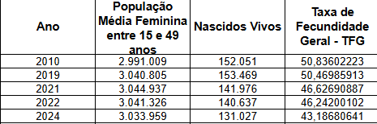
```

$nfx = \frac{Nx}{P_fx}$ e $TEF = \frac{Nx}{Pfx} \times 1000$

$nfx$: Nascidos vivos por grupo etário da mãe

$TEF$: Taxas Específicas de Fecundidade

$Nx$: Nascidos vivos de mãe entre as idades x e x+n

$P_fx$: População média feminina entre as idades x e x+n

```{r, echo=FALSE, out.width="110%", fig.align='center'}
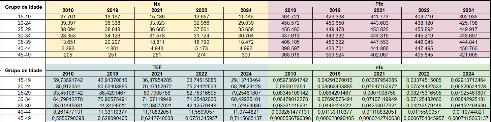
```

Gráficos de $TFG$ e $nfx$:

```{r, echo=FALSE, out.width="70%", fig.align='center'}
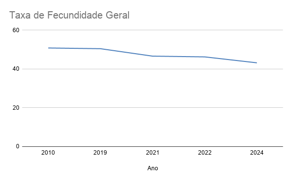
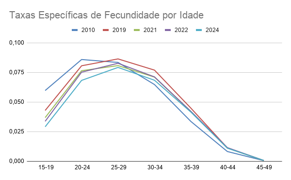
```

$TFT = 5\sum_{i=1}^{7} f_i$

$TFT$: Taxa de Fecundidade Total

$f_i$: grupos quinquenais de $nfx$

```{r, echo=FALSE, out.width="110%", fig.align='center'}
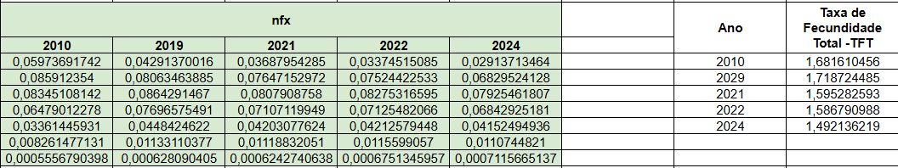
```

$f^f_x = \frac{N_f}{P_fx} \times 1000$

$f^f_x$: Taxas Específicas de Fecundidade feminina

$N_f$: Nascidos vivos femininos de mães entre as idades x e x+n

$P_fx$: População média feminina entre as idades x e x+n

```{r, echo=FALSE, out.width="110%", fig.align='center'}
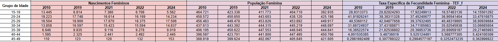
```

$TBR = 5\sum_{i=1}^{7} f^f_i$

$TBR$: Taxa Bruta de Reprodução

$f^f_i$: grupos quinquenais de $f^f_x$

```{r, echo=FALSE, out.width="110%", fig.align='center'}
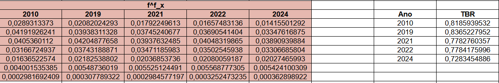
```

$TLR = \sum_{i=1}^{7} f^f_i \times\frac{L^f_i}{l_0}$

$TLR$: Taxa Líquida de Reprodução

$f^f_i$: grupos quinquenais de $f^f_x$

$L^f_i$: Função da Tábua de vida

$l_0$: raiz da Tábua de vida, representa o número de nascimentos

```{r, echo=FALSE, out.width="110%", fig.align='center'}
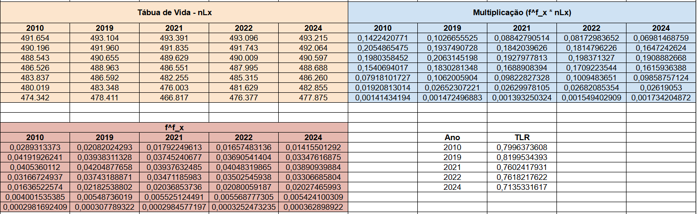
```

b\) Obtenha todos os indicadores de 2022, considerando a população recenseada nesse ano.

**Resposta:**

$TBN$:

```{r, echo=FALSE, out.width="40%", fig.align='center'}
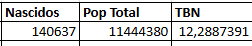
```

$TFG$:

```{r, echo=FALSE, out.width="40%", fig.align='center'}
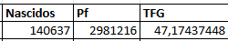
```

$nfx$ e $TEF$:

```{r, echo=FALSE, out.width="40%", fig.align='center'}
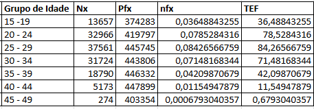
```

Gráficos de $TFG$ e $nfx$:

```{r, echo=FALSE, out.width="40%", fig.align='center'}
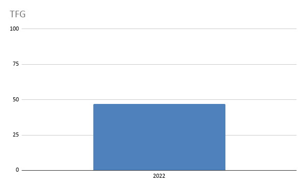
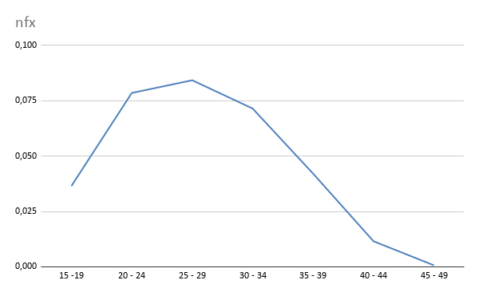
```

$TFT$:

```{r, echo=FALSE, out.width="35%", fig.align='center'}
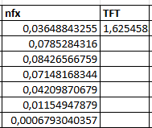
```

$f^f_x$:

```{r, echo=FALSE, out.width="40%", fig.align='center'}
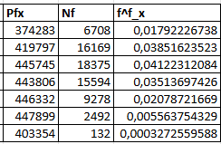
```

$TBR$:

```{r, echo=FALSE, out.width="40%", fig.align='center'}
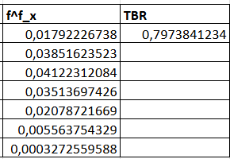
```

$TLR$:

```{r, echo=FALSE, out.width="70%", fig.align='center'}
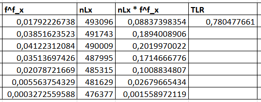
```

c\) Comente esses resultados (inclusive os gráficos das nfx), fazendo referência a artigos já publicados sobre o assunto.

**Resposta:** As taxas específicas de fecundidade (nfx) aumentam gradualmente até o grupo de 20 a 29 anos e depois caem bruscamente a partir do ponto máximo de cada curva. Esse padrão se mantém em todos os anos analisados (2010, 2019, 2021, 2022 e 2024 - no caso da questão 2a), indicando que a fecundidade está concentrada nas idades adultas mais jovens, com poucos nascimentos no início e no final da vida reprodutiva. As demais taxas apresentam a mesma queda que a nfx. As taxas líquidas de reprodução, tanto na 2a quanto na 2b, estão abaixo de 1, ou seja, abaixo do nível de reposição, o que indica que ao longo do tempo, a população decresce.

d\) Para os dados do SINASC para 2024, analise a associação entre (apresente ao menos uma medida de associação):

-   idade (em grupos de idade) e escolaridade da mãe (apresente a tabela de contingência e as frequências relativas)

-   tipo de parto e escolaridade da mãe (apresente a tabela de contingência e as frequências relativas)

Apresente graficamente os dados, obtenha medidas para essa associação e comente os resultados.

**Resposta:**

Tabela e Gráfico de Contingência Escolaridade por Idade da mãe
```{r, echo=FALSE, out.width="70%", fig.align='center'}
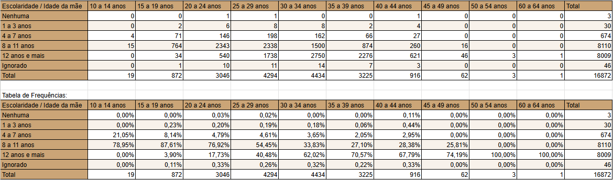
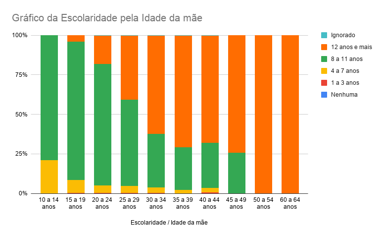
```
 
V de Cramer Interpretação < 0,10 Associação muito fraca 0,10 - 0,30 Associação fraca 0,30 - 0,50 Associação moderada 0,50 Associação forte Resumo para sua resposta: Análise Medida Valor Interpretação Idade vs. Escolaridade V de Cramer = 0,155 Entre 0,10-0,30 Associação fraca Parto vs. Escolaridade RP = 1,67 1 Escolaridade alta é fator de risco para cesárea (67% mais chance) Parto vs. Escolaridade RP = 0,60 < 1
Escolaridade alta é fator de proteção contra cesárea (40% menos chance) 

Análise (v de cramer = 0.1932063)


Tabela e Gráfico da Escolaridade pelo Tipo de parto da mãe
```{r, echo=FALSE, out.width="70%", fig.align='center'}
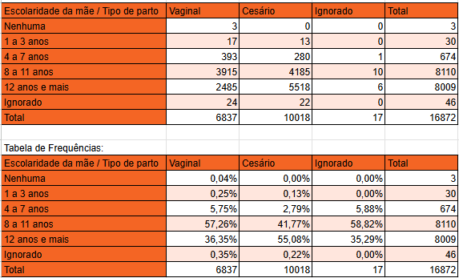
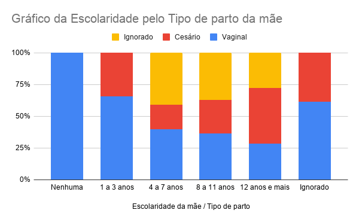
```


Análise (v de cramer = 0.1337143/ associação fraca (0.10-0.15))


### **Questão 3: Mortalidade**

a\) Com base nos dados sobre óbitos do SIM para os anos: 2010, 2019, 2021, 2022 e 2024 e a população por sexo e idade estimada (projetada) para a UF ou território escolhido, obtenha os seguintes indicadores:

-   Taxa Bruta de Mortalidade

-   Taxas específicas de mortalidade por sexo e idade - nMx (grafique)

**Resposta:**

$Taxa\ Bruta\ de\ Mortalidade$:

```{r, echo=FALSE, fig.align="center"}
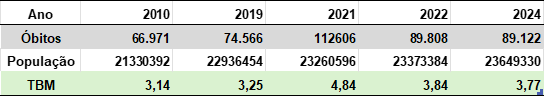
```


$Taxas\ Específicas\ de\ Mortalidade\ por\ sexo\ e\ idade$

- 2010

::: {.columns}

::: {.column width="50%"}

```{r, echo=FALSE, fig.align="center"}
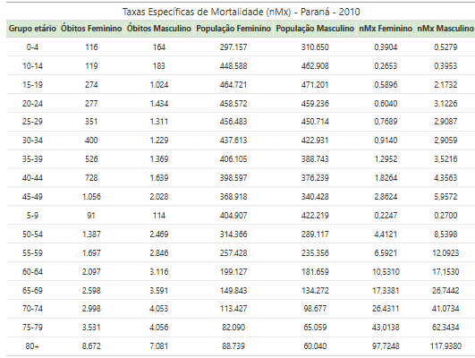
```

:::

::: {.column width="50%"}

```{r, echo=FALSE, fig.align="center"}
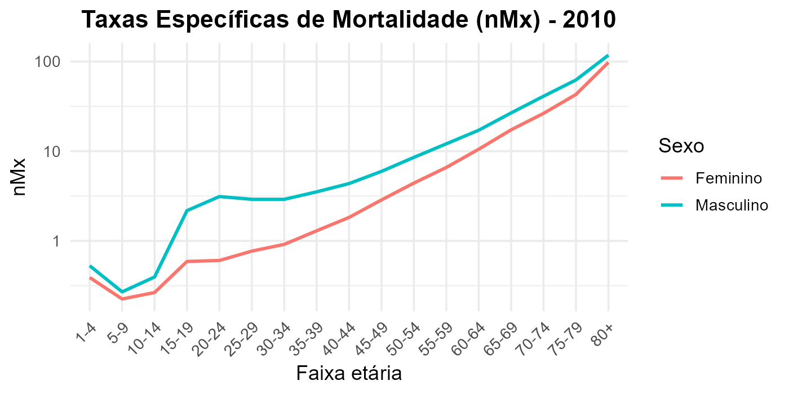
```

:::

:::

- 2019

::: {.columns}

::: {.column width="50%"}

```{r, echo=FALSE, out.width="100%", fig.align="center"}
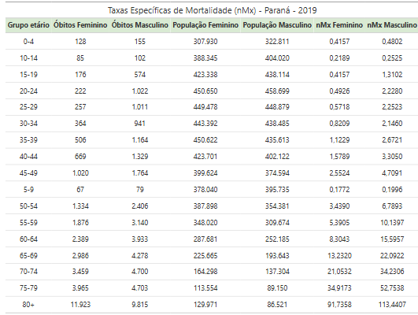
```

:::

::: {.column width="50%"}

```{r, echo=FALSE, out.width="100%", fig.align="center"}
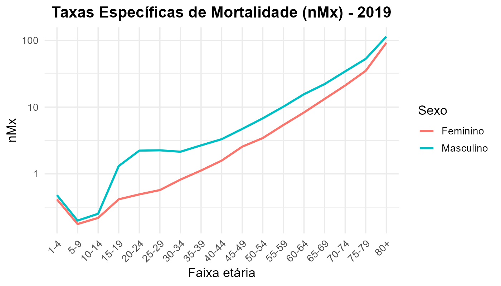
```

:::

:::


- 2021

::: {.columns}

::: {.column width="50%"}

```{r, echo=FALSE, out.width="100%", fig.align="center"}
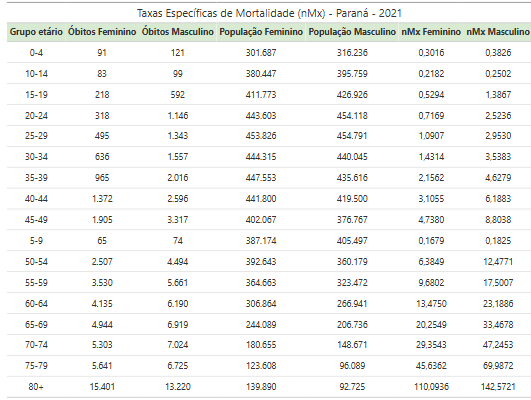
```

:::

::: {.column width="50%"}

```{r, echo=FALSE, out.width="100%", fig.align="center"}

```

:::

:::


- 2022

::: {.columns}

::: {.column width="50%"}

```{r, echo=FALSE, out.width="100%", fig.align="center"}
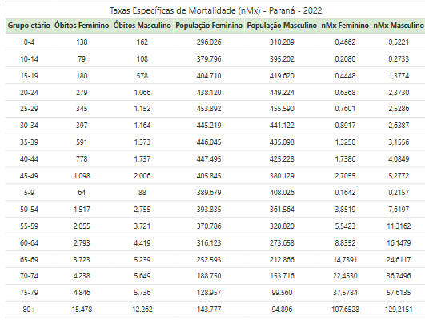
```

:::

::: {.column width="50%"}

```{r, echo=FALSE, out.width="100%", fig.align="center"}
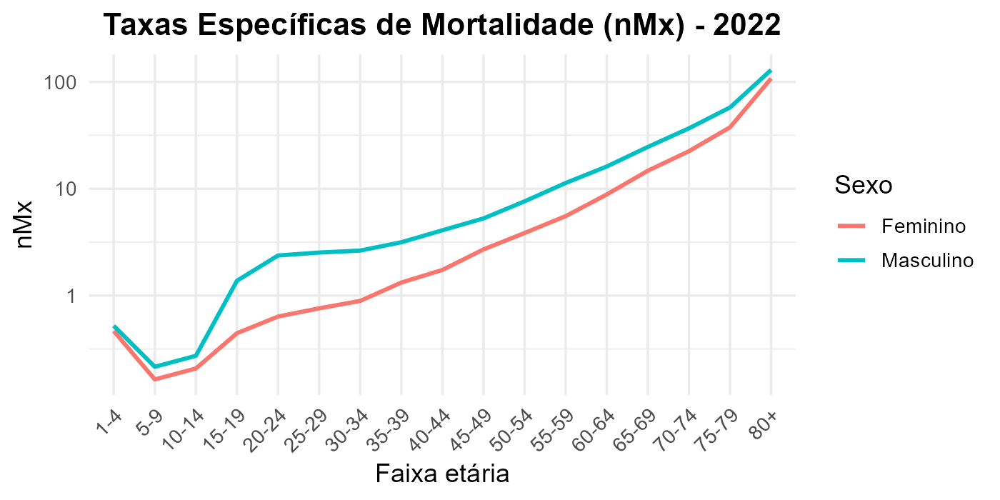
```

:::

:::


- 2024

::: {.columns}

::: {.column width="50%"}

```{r, echo=FALSE, out.width="100%", fig.align="center"}
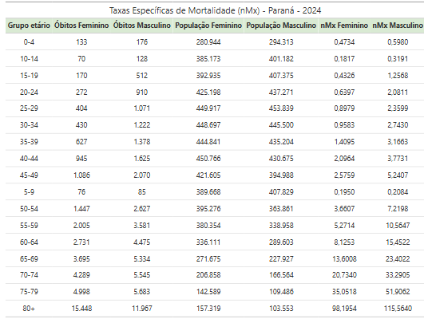
```

:::

::: {.column width="50%"}

```{r, echo=FALSE, out.width="100%", fig.align="center"}
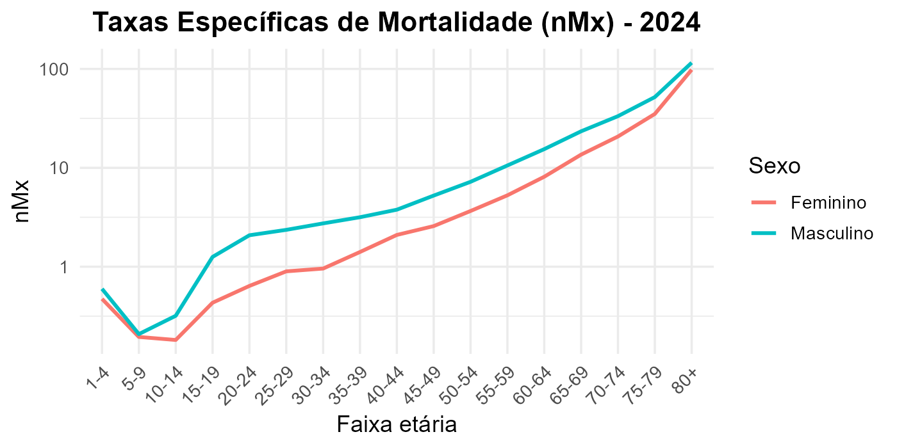
```

:::

:::


- Comparação anual

```{r, echo=FALSE, out.width="70%", fig.align="center"}
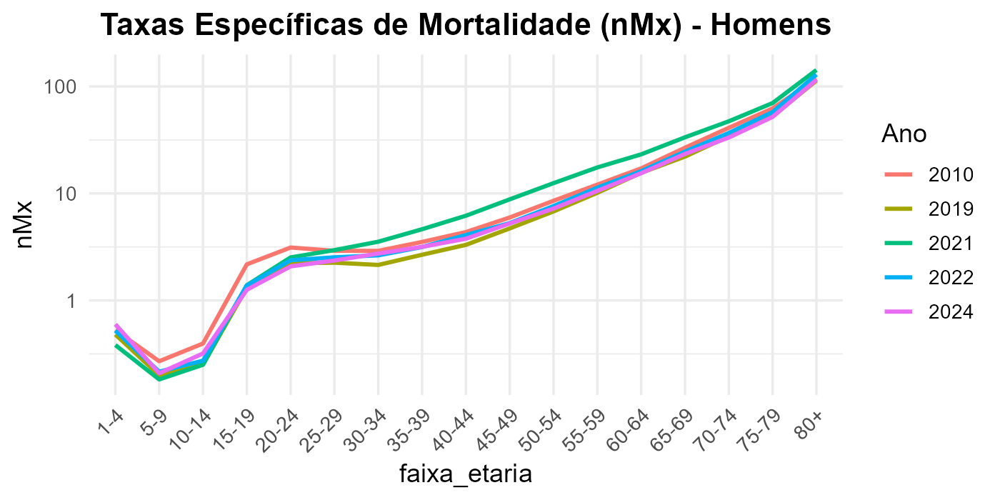
```


```{r, echo=FALSE, out.width="70%", fig.align="center"}
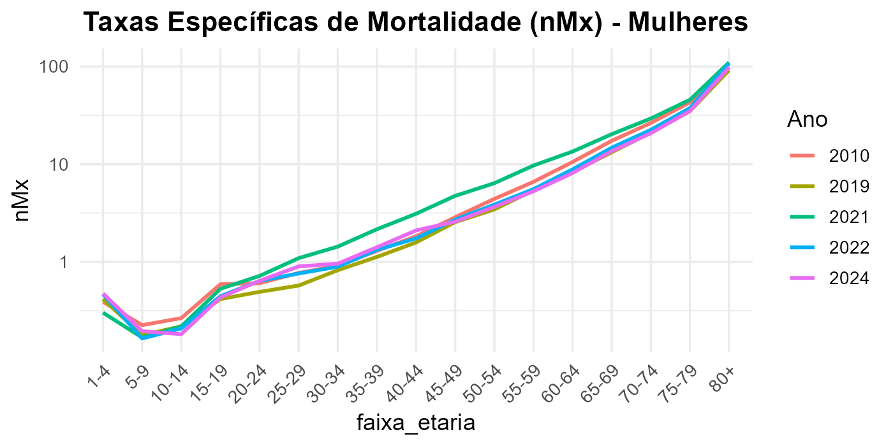
```


b\) Calcule a TMI, utilizando o **número médio de óbitos ocorridos entre 2022 e 2024 (numerador) e o número de nascimentos de 2023 (denominador**). Calcule os indicadores: taxa de mortalidade neonatal, neonatal precoce, neonatal tardia, posneonatal. A partir da informação sobre óbitos fetais dos mesmos anos, calcule a taxa de mortalidade perinatal.

**Resposta:**

$Taxa\ de\ Mortalidade\ Infantil\ Neonatal$
```{r, echo=FALSE}

```

$Taxa\ de\ Mortalidade\ Infantil\ Precoce$
```{r, echo=FALSE}

```

$Taxa\ de\ Mortalidade\ Infantil\ Tardia$
```{r, echo=FALSE}

```

$Taxa\ de\ Mortalidade\ Infantil\ Posneonatal$
```{r, echo=FALSE}

```

$Taxa\ de\ Mortalidade\ Infantil\ Perinatal$
```{r, echo=FALSE}

```

c\) Compare a estrutura de mortalidade por causas entre 2010, 2021 e 2024. Utilize 20 grupos de causas mais frequentes, segundo os grupos do CID-10 (ver Tabnet - Datasus), por sexo, e grupos de idade (\<5; 5 a 14; 15-39; 40-59; 60 e +) para os anos selecionados. Comente os resultados. Destacar a mortalidade por Covid-19 (CID B34.2).

**Resposta:**

d\) Construa Tábuas de Vida para cada sexo para a UF escolhida para 2010 e 2024, a partir das taxas específicas de mortalidade obtidas no item a:

-   Utilize a TMI obtida no item b. Lembre-se de que deve-se obter a TMI para cada sexo em separado.

-   Estime os fatores de separação para cada sexo, nas idades 0-1 e 1-4, com base nos microdados do SIM.

-   Compare os valores da função de esperança de vida para as idades exatas 0 e 60 com os obtidos no estudo do IBGE (Projeções) e no estudo GBD. Comente os resultados obtidos e o significado desses indicadores.

-   Com base na TV calculada, grafique as funções lx e nqx para cada sexo e comente os resultados.

-   Comente os resultados à luz de artigos recém publicados.

**Resposta:**