```{r setup}
#| include: false
```

### **Questão 1: Diagrama de Lexis**

a\) Construir o Diagrama de Lexis para os dados de nascidos vivos de 2000 a 2024 da UF escolhida (SINASC) e de óbitos menores de 5 anos (idades simples) para o mesmo período segundo o ano de nascimento.

**Resposta:**

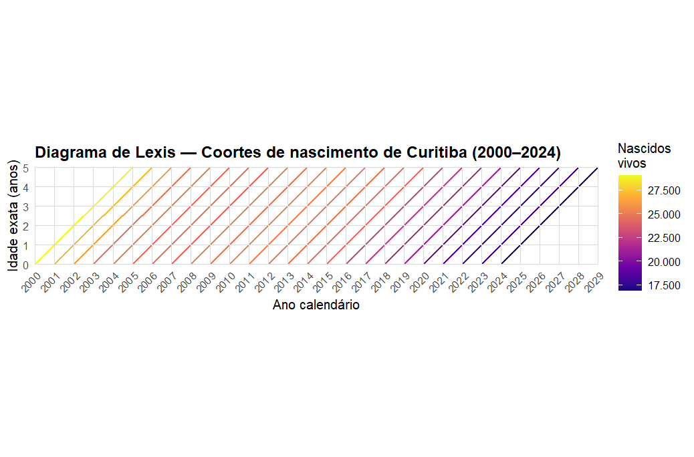

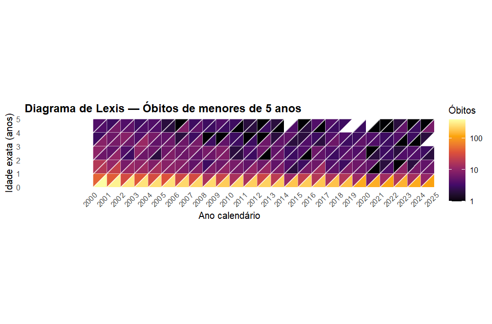

b\) Supondo população fechada (inexistência de migração), calcule a probabilidade de um recém-nascido na UF ou no território de escolha sobreviver à idade exata de 5 para as coortes de 2000 a 2019.

**Resposta:**

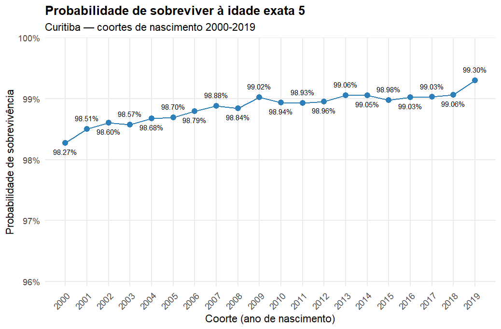

c\) Considerando o mesmo pressuposto, calcule a probabilidade de sobreviver ao primeiro aniversário dos recém-nascidos no período de 2000 a 2023.

**Resposta:**

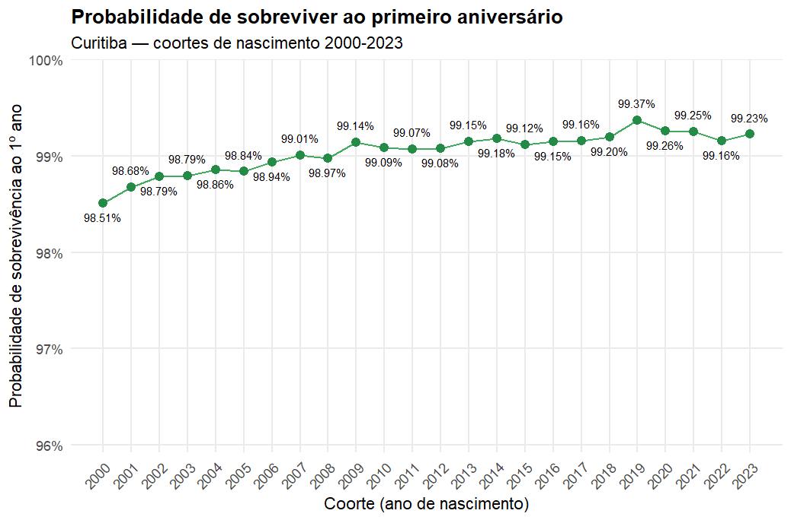

d\) Para os anos de 2022 e 2023, calcule a probabilidade de morrer antes de completar o primeiro aniversário, segundo raça/cor (Desafio)

**Resposta:**

e\) Comente os valores encontrados. Não se esquecer da qualidade da informação trabalhada.

**Resposta:**

### **Questão 2: Natalidade/Fecundidade**

a\) Com base nos dados do SINASC, para cada um dos anos seguintes: 2010, 2019, 2021, 2022 e 2024, e na população por sexo e idade estimada (projetada), construa os seguintes indicadores para a Unidade da Federação (Use as projeções do IBGE - Revisão 2024) :

-   Taxa Bruta de Natalidade

-   Taxa Fecundidade Geral (TFG) e Taxas específicas de fecundidade - nfx (Grafique esses valores)

-   Taxa de Fecundidade Total (TFT) ou Índice Sintético de Fecundidade

-   Taxas específicas de fecundidade feminina (apenas os nascimentos femininos)

-   Taxa Bruta de Reprodução

-   Taxa Líquida de Reprodução (é necessária a informação da função L da Tábua de Vida)

**Resposta:** Para resolver essa questão, foram utilizadas seis tabelas diferentes, sendo duas vindas do Ripsa ("População residente por Ano segundo Faixa Etária 2, Município: 410690 CURITIBA, Período: 2010, 2019, 2021-2022, 2024"; "População residente por Ano segundo Faixa Etária 2, Município: 410690 CURITIBA, Sexo: Feminino, Período: 2010, 2019, 2021-2022, 2024"), duas vindas do DataSus - Tabnet ("Nascim p/resid.mãe por Ano do nascimento segundo Idade da mãe, Capital: 410690 Curitiba, Período: 2010, 2019, 2021-2022, 2024"; "Nascim p/resid.mãe por Ano do nascimento segundo Idade da mãe, Município: 410690 CURITIBA, Sexo: Fem, Período: 2010, 2019, 2021-2022, 2024"), e duas vindas da Projeção de População do IBGE ("População por sexo e grupos quiquenais", "Tábuas de Mortalidade")

$TBN = \frac{N}{P} \times 1000$

$TBN$: Taxa Bruta de Natalidade

$N$: Número total de nascidos vivos ocorridos no período

$P$: População média do período

```{=latex}
\begin{table}[ht]
\centering
\caption{Taxa Bruta de Natalidade}
\begin{tabular}{|l|ccccc|}
\hline
Taxa & 2010 & 2019 & 2021 & 2022 & 2024 \\ 
\hline
TBN & 14,019 & 11,598 & 10,090 & 10,017 & 9,224 \\ 
\hline
\end{tabular}
\end{table}
```

$TFG = \frac{N}{P_f} \times 1000$

$TFG$: Taxa de Fecundidade Geral

$N$: Número total de nascidos vivos ocorridos no período

$P_f$: População feminina média entre 15 e 49 anos

```{=latex}
\begin{table}[ht]
\centering
\caption{Taxas de Fecundidade Geral}
\begin{tabular}{|l|ccccc|}
\hline
Taxa & 2010 & 2019 & 2021 & 2022 & 2024 \\ 
\hline
TFG & 47,284 & 42,157 & 37,169 & 37,128 & 34,726 \\ 
\hline
\end{tabular}
\end{table}
```

$nfx = \frac{Nx}{P_fx}$

*obs:* Geralmente, em tabelas, a $nfx$ aparece multiplicada por 1000. Entretanto, para fazer os demais cálculos e gráficos, ela aparece da forma que é calculada - com casas decimais.

$nfx$: Taxas Específicas de Fecundidade

$Nx$: Nascidos vivos de mãe entre as idades $x$ e $x+n$

$P_fx$: População média feminina entre as idades $x$ e $x+n$

```{=latex}
\begin{table}[ht]
\centering
\caption{Taxas específicas de fecundidade}
\begin{tabular}{|l|l|ccccc|}
\hline
Taxa & Idade & 2010 & 2019 & 2021 & 2022 & 2024 \\ 
\hline
\multirow{7}{*}{nfx} 
& 15-19 & 48,531 & 26,508 & 20,202 & 18,128 & 15,464 \\ 
& 20-24 & 70,566 & 59,563 & 52,531 & 52,120 & 46,246 \\ 
& 25-29 & 73,706 & 67,823 & 61,895 & 63,043 & 59,996 \\ 
& 30-34 & 70,676 & 71,983 & 64,595 & 64,544 & 62,665 \\ 
& 35-39 & 40,456 & 49,945 & 44,928 & 45,492 & 44,647 \\ 
& 40-44 & 9,201 & 11,765 & 11,256 & 12,442 & 11,907 \\ 
& 45-49 & 0,615 & 0,788 & 0,814 & 0,849 & 0,860 \\ 
\hline
\end{tabular}
\end{table}
```

Gráficos de $nfx$ e $TFG$:

::: {style="text-align: center;"}
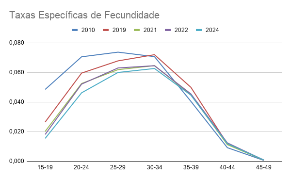{width=65%}
:::
::: {style="text-align: center;"}
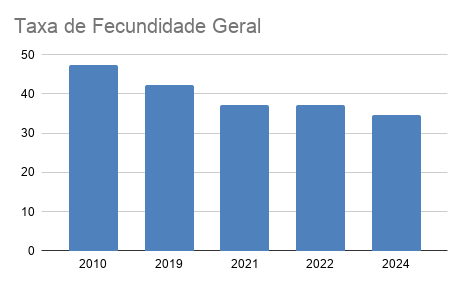{width=65%}
:::

$TFT = 5\sum_{i=1}^{7} f_i$

$TFT$: Taxa de Fecundidade Total

$f_i$: grupos quinquenais de $nfx$

```{=latex}
\begin{table}[ht]
\centering
\caption{Taxa de Fecundidade Total}
\begin{tabular}{|l|ccccc|}
\hline
Taxa & 2010 & 2019 & 2021 & 2022 & 2024 \\ 
\hline
TFT & 1,569 & 1,442 & 1,281 & 1,283 & 1,209 \\ 
\hline
\end{tabular}
\end{table}
```

$f^f_x = \frac{N_f}{P_fx}$

*obs:* Assim como a $nfx$, a $f^f_x$ é apresentada, em tabelas, sendo multiplicada por 1000, mas para os demais cálculos, ela aparece da forma como é calculada.

$f^f_x$: Taxas Específicas de Fecundidade feminina

$N_f$: Nascidos vivos femininos de mães entre as idades $x$ e $x+n$

$P_fx$: População média feminina entre as idades $x$ e $x+n$

```{=latex}
\begin{table}[ht]
\centering
\caption{Taxas Específicas de Fecundidade Feminina}
\begin{tabular}{|l|l|ccccc|}
\hline
Taxa & Idade & 2010 & 2019 & 2021 & 2022 & 2024 \\ 
\hline
\multirow{7}{*}{$f^f_x$}
& 15-19 & 23,510 & 13,174 & 9,925 & 8,987 & 7,271 \\ 
& 20-24 & 34,843 & 29,474 & 26,095 & 25,850 & 23,169 \\ 
& 25-29 & 35,973 & 33,314 & 30,334 & 32,140 & 29,285 \\ 
& 30-34 & 34,759 & 34,901 & 30,858 & 32,168 & 31,022 \\ 
& 35-39 & 19,628 & 24,306 & 22,196 & 22,087 & 21,541 \\ 
& 40-44 & 4,572 & 5,762 & 5,583 & 6,036 & 5,486 \\ 
& 45-49 & 0,337 & 0,321 & 0,392 & 0,503 & 0,388 \\ 
\hline
\end{tabular}
\end{table}
```

$TBR = 5\sum_{i=1}^{7} f^f_i$

$TBR$: Taxa Bruta de Reprodução

$f^f_i$: grupos quinquenais de $f^f_x$

```{=latex}
\begin{table}[ht]
\centering
\caption{Taxa Bruta de Reprodução}
\begin{tabular}{|l|ccccc|}
\hline
Taxa & 2010 & 2019 & 2021 & 2022 & 2024 \\ 
\hline
TBR & 0,766 & 0,705 & 0,625 & 0,636 & 0,589 \\ 
\hline
\end{tabular}
\end{table}
```

$TLR = \sum_{i=1}^{7} f^f_i \times\frac{L^f_i}{l_0}$

$TLR$: Taxa Líquida de Reprodução

$f^f_i$: grupos quinquenais de $f^f_x$

$L^f_i$: Função da Tábua de vida

$l_0$: raiz da Tábua de vida, representa o número de nascimentos (nesse caso, 100.000)

```{=latex}
\begin{table}[ht]
\centering
\caption{Tábua de vida (Paraná)}
\begin{tabular}{|l|ccccc|}
\hline
Tábua de vida & 2010 & 2019 & 2021 & 2022 & 2024 \\ 
\hline
\multirow{7}{*}{$nLx$}
& 491.654 & 493.104 & 493.391 & 493.096 & 493.215 \\ 
& 490.196 & 491.960 & 491.835 & 491.743 & 492.064 \\ 
& 488.543 & 490.655 & 489.629 & 490.009 & 490.597 \\ 
& 486.526 & 488.963 & 486.551 & 487.995 & 488.688 \\ 
& 483.837 & 486.592 & 482.255 & 485.315 & 486.260 \\ 
& 480.019 & 483.348 & 476.003 & 481.629 & 482.855 \\ 
& 474.342 & 478.411 & 466.817 & 476.377 & 477.875 \\ 
\hline
\end{tabular}
\end{table}
```
```{=latex}
\begin{table}[ht]
\centering
\caption{Taxas específicas de fecundidade feminina (Paraná)}
\begin{tabular}{|l|l|ccccc|}
\hline
Taxa & Idade & 2010 & 2019 & 2021 & 2022 & 2024 \\ 
\hline
\multirow{7}{*}{$f^f_x$}
& 15-19 & 28,931 & 20,820 & 17,922 & 16,575 & 14,155 \\ 
& 20-24 & 41,919 & 39,383 & 37,452 & 36,905 & 33,476 \\ 
& 25-29 & 40,536 & 42,049 & 39,376 & 40,483 & 38,909 \\ 
& 30-34 & 31,667 & 37,432 & 34,712 & 35,025 & 33,067 \\ 
& 35-39 & 16,365 & 21,825 & 20,369 & 20,801 & 20,275 \\ 
& 40-44 & 4,002 & 5,487 & 5,525 & 5,569 & 5,424 \\ 
& 45-49 & 0,298 & 0,308 & 0,298 & 0,325 & 0,363 \\ 
\hline
\end{tabular}
\end{table}
```
```{=latex}
\begin{table}[H]
\centering
\caption{Multiplicação (Paraná)}
\begin{tabular}{|l|l|ccccc|}
\hline
Multiplicação & Idade & 2010 & 2019 & 2021 & 2022 & 2024 \\ 
\hline
\multirow{7}{*}{$f^f_i \cdot \frac{L^f_i}{l_0}$}
& 15-19 & 0,142 & 0,103 & 0,088 & 0,082 & 0,070 \\ 
& 20-24 & 0,205 & 0,194 & 0,184 & 0,181 & 0,165 \\ 
& 25-29 & 0,198 & 0,206 & 0,193 & 0,198 & 0,191 \\ 
& 30-34 & 0,154 & 0,183 & 0,169 & 0,171 & 0,162 \\ 
& 35-39 & 0,079 & 0,106 & 0,098 & 0,101 & 0,099 \\ 
& 40-44 & 0,019 & 0,027 & 0,026 & 0,027 & 0,026 \\ 
& 45-49 & 0,001 & 0,001 & 0,001 & 0,002 & 0,002 \\ 
\hline
\end{tabular}
\end{table}
```
```{=latex}
\begin{table}[ht]
\centering
\caption{Taxa Líquida de Reprodução (Paraná)}
\begin{tabular}{|l|ccccc|}
\hline
Taxa & 2010 & 2019 & 2021 & 2022 & 2024 \\ 
\hline
TLR & 0,800 & 0,820 & 0,760 & 0,762 & 0,714 \\ 
\hline
\end{tabular}
\end{table}
```

Nos anos analisados (2010, 2019, 2021, 2022 e 2024), Curitiba apresentou redução da natalidade e da fecundidade. A TBN caiu de 14,019 para 9,224 nascimentos por mil habitantes, enquanto a TFG reduziu de 47,284 para 34,726, indicando diminuição do número de nascimentos e do número médio de filhos por mulher. Além disso, as Taxas Específicas de Fecundidade mostram um deslocamento da fecundidade para idades mais elevadas. Em 2010, o pico ocorreu entre 25–29 anos, indicando fecundidade tardia, mas, a partir de 2019, passou para 30–34 anos, caracterizando fecundidade muito tardia.

A TFT caiu de 1,569 para 1,209 filhos por mulher, permanecendo abaixo do nível de reposição populacional (aproximadamente 2,1 filhos por mulher) em todos os anos analisados. Isso indica que a população não está se reproduzindo em nível suficiente para substituir as gerações futuras. O mesmo ocorre com a TBR e a TLR, que permaneceram abaixo de 1 durante todo o período. Como a TLR possui nível de reposição igual a 1, os valores observados indicam que cada geração de mulheres não está conseguindo substituir integralmente a geração anterior. Para a TLR, foram utilizados dados do Paraná como aproximação para Curitiba.

De forma geral, os resultados mostram que as mulheres estão tendo menos filhos e em idades mais avançadas. Além disso, como os níveis de fecundidade e reprodução ficaram abaixo do nível de reposição, a tendência é de envelhecimento da população e diminuição do crescimento populacional ao longo do tempo.


b\) Obtenha todos os indicadores de 2022, considerando a população recenseada nesse ano.

**Resposta:** Já para essa questão, foram utilizadas quatro tabelas diferentes, sendo uma vinda do Censo de 2022 do IBGE ("População por idade e sexo | Resultados do universo (Paraná - Curitiba)"), duas vindas do DataSus - Tabnet ("Nascim p/resid.mãe por Ano do nascimento segundo Idade da mãe, Município: 410690 CURITIBA, Período: 2022"; "Nascim p/resid.mãe por Ano do nascimento segundo Idade da mãe, Município: 410690 CURITIBA, Sexo: Fem, Período: 2022"), e uma vindas da Projeção de População do IBGE ("Tábuas de Mortalidade")

```{=latex}
\begin{table}[H]
\centering
\caption{Indicadores de fecundidade e reprodução — 2022}
\begin{tabular}{|l|l|c|}
\hline
Taxa & Idade & 2022 \\ 
\hline
TBN &  & 10,371 \\ 
\hline
TFG &  & 38,449 \\ 
\hline

\multirow{7}{*}{nfx}
& 15-19 & 20,071 \\ 
& 20-24 & 54,829 \\ 
& 25-29 & 65,563 \\ 
& 30-34 & 66,066 \\ 
& 35-39 & 46,248 \\ 
& 40-44 & 12,539 \\ 
& 45-49 & 0,869 \\ 
\hline

TFT &  & 1,331 \\ 
\hline

\multirow{7}{*}{$f^f_x$}
& 15-19 & 9,950 \\ 
& 20-24 & 27,194 \\ 
& 25-29 & 33,425 \\ 
& 30-34 & 32,927 \\ 
& 35-39 & 22,454 \\ 
& 40-44 & 6,083 \\ 
& 45-49 & 0,516 \\ 
\hline

TBR &  & 0,663 \\ 
\hline

\multirow{7}{*}{$f^f_i \cdot \frac{L^f_i}{l_0}$}
& 15-19 & 0,049 \\ 
& 20-24 & 0,134 \\ 
& 25-29 & 0,164 \\ 
& 30-34 & 0,161 \\ 
& 35-39 & 0,109 \\ 
& 40-44 & 0,029 \\ 
& 45-49 & 0,002 \\ 
\hline

TLR &  & 0,648 \\ 
\hline
\end{tabular}
\end{table}
```

Gráficos de $nfx$ e $TFG$:

::: {style="text-align: center;"}
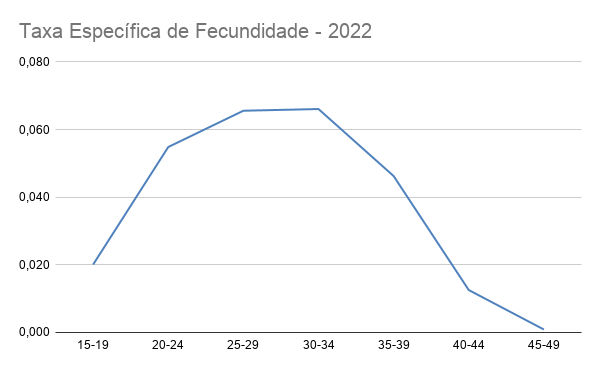{width=65%}
:::
::: {style="text-align: center;"}
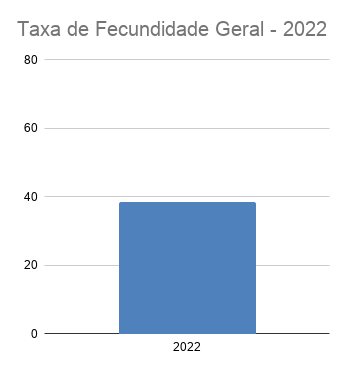{width=40%}
:::

Com base nos dados do Censo 2022, observa-se que Curitiba (considerando o recorte apresentado) mantém a tendência de queda na natalidade e na fecundidade. A Taxa de Fecundidade Geral (TFG) ficou em 38,5, o que reforça a diminuição do número de nascimentos em relação ao total de mulheres em idade fértil. As Taxas Específicas de Fecundidade mostram que o comportamento reprodutivo está consolidado em idades mais avançadas. O pico de fecundidade ocorre agora de forma dividida entre as faixas de 25–29 e 30–34 anos (ambas com 0,066), o que caracteriza uma fecundidade tardia/ muito tardia.

A TFT calculada a partir desses dados é de aproximadamente 1,33 filhos por mulher, permanecendo bem abaixo do nível de reposição populacional, que seria de 2,1 filhos (ou TLR = 1). Isso indica que a população não está conseguindo se reproduzir em nível suficiente para substituir as gerações atuais pelas futuras. De forma geral, os resultados do Censo confirmam que as mulheres estão tendo menos filhos e optando pela maternidade cada vez mais tarde. Como os níveis de fecundidade e reposição estão baixos, a tendência para o futuro continua sendo de envelhecimento populacional e redução no ritmo de crescimento da cidade.

c\) Comente esses resultados (inclusive os gráficos das nfx), fazendo referência a artigos já publicados sobre o assunto.

**Resposta:** Os resultados obtidos para Curitiba mostram, de forma geral, uma queda consistente da natalidade e da fecundidade ao longo do período analisado, o que é evidenciado pela redução da TBN, TFG e TFT. Além disso, os níveis de fecundidade e reprodução permanecem abaixo do nível de reposição em todos os anos, indicando que a geração atual não está sendo substituída integralmente pela seguinte.

Nos gráficos de nfx, observa-se também uma mudança importante no padrão etário da fecundidade. Em 2010, o pico estava concentrado em 25–29 anos, enquanto nos anos mais recentes há um deslocamento para 30–34 anos, além de uma queda mais acentuada nas idades mais jovens. Isso indica um adiamento da maternidade e uma menor concentração de nascimentos em idades precoces.

Esses resultados estão de acordo com o que é apontado em estudos e dados do IBGE, que mostram a redução contínua da fecundidade no Brasil e o aumento da idade média ao ter filhos. A literatura também destaca que esse padrão está relacionado a mudanças no comportamento reprodutivo ao longo do tempo. De forma geral, os resultados indicam não só redução do nível de fecundidade, mas também mudança no calendário reprodutivo, com menos filhos e em idades mais tardias.


d\) Para os dados do SINASC para 2024, analise a associação entre (apresente ao menos uma medida de associação):

-   idade (em grupos de idade) e escolaridade da mãe (apresente a tabela de contingência e as frequências relativas)

-   tipo de parto e escolaridade da mãe (apresente a tabela de contingência e as frequências relativas)

Apresente graficamente os dados, obtenha medidas para essa associação e comente os resultados.

**Resposta:**

Tabela e Gráfico de Contingência Escolaridade por Idade da mãe

```{r, echo=FALSE, out.width="70%", fig.align='center'}
knitr::include_graphics("quest2/TCTF1.png")
knitr::include_graphics("quest2/grafico1.png")
```

V de Cramer Interpretação \< 0,10 Associação muito fraca 0,10 - 0,30 Associação fraca 0,30 - 0,50 Associação moderada 0,50 Associação forte Resumo para sua resposta: Análise Medida Valor Interpretação Idade vs. Escolaridade V de Cramer = 0,155 Entre 0,10-0,30 Associação fraca Parto vs. Escolaridade RP = 1,67 1 Escolaridade alta é fator de risco para cesárea (67% mais chance) Parto vs. Escolaridade RP = 0,60 \< 1 Escolaridade alta é fator de proteção contra cesárea (40% menos chance)

Análise (v de cramer = 0.1932063)

Tabela e Gráfico da Escolaridade pelo Tipo de parto da mãe

```{r, echo=FALSE, out.width="70%", fig.align='center'}
knitr::include_graphics("quest2/TCTF2.png")
knitr::include_graphics("quest2/grafico2.png")
```

Análise (v de cramer = 0.1337143/ associação fraca (0.10-0.15))

### **Questão 3: Mortalidade**

a\) Com base nos dados sobre óbitos do SIM para os anos: 2010, 2019, 2021, 2022 e 2024 e a população por sexo e idade estimada (projetada) para a UF ou território escolhido, obtenha os seguintes indicadores:

-   Taxa Bruta de Mortalidade

-   Taxas específicas de mortalidade por sexo e idade - nMx (grafique)

**Resposta:**

$Taxa\ Bruta\ de\ Mortalidade$:

```{r, echo=FALSE, fig.align="center"}
knitr::include_graphics("questao-3/tbm.png")
```

$Taxas\ Específicas\ de\ Mortalidade\ por\ sexo\ e\ idade$

-   2010

::::: columns
::: {.column width="50%"}
```{r, echo=FALSE, fig.align="center"}
knitr::include_graphics("questao-3/tabela_nmx_2010.png")
```
:::

::: {.column width="50%"}
```{r, echo=FALSE, fig.align="center"}
knitr::include_graphics("questao-3/grafico_nmx_2010.png")
```
:::
:::::

-   2019

::::: columns
::: {.column width="50%"}
```{r, echo=FALSE, out.width="100%", fig.align="center"}
knitr::include_graphics("questao-3/tabela_nmx_2019.png")
```
:::

::: {.column width="50%"}
```{r, echo=FALSE, out.width="100%", fig.align="center"}
knitr::include_graphics("questao-3/grafico_nmx_2019.png")
```
:::
:::::

-   2021

::::: columns
::: {.column width="50%"}
```{r, echo=FALSE, out.width="100%", fig.align="center"}
knitr::include_graphics("questao-3/tabela_nmx_2021.png")
```
:::

::: {.column width="50%"}
```{r, echo=FALSE, out.width="100%", fig.align="center"}
knitr::include_graphics("questao-3/grafico_nmx_2021.png")
```
:::
:::::

-   2022

::::: columns
::: {.column width="50%"}
```{r, echo=FALSE, out.width="100%", fig.align="center"}
knitr::include_graphics("questao-3/tabela_nmx_2022.png")
```
:::

::: {.column width="50%"}
```{r, echo=FALSE, out.width="100%", fig.align="center"}
knitr::include_graphics("questao-3/grafico_nmx_2022.png")
```
:::
:::::

-   2024

::::: columns
::: {.column width="50%"}
```{r, echo=FALSE, out.width="100%", fig.align="center"}
knitr::include_graphics("questao-3/tabela_nmx_2024.png")
```
:::

::: {.column width="50%"}
```{r, echo=FALSE, out.width="100%", fig.align="center"}
knitr::include_graphics("questao-3/grafico_nmx_2024.png")
```
:::
:::::

-   Comparação anual

```{r, echo=FALSE, out.width="100%", fig.align="center"}
knitr::include_graphics("questao-3/nmx_homens.png")
```

```{r, echo=FALSE, out.width="100%", fig.align="center"}
knitr::include_graphics("questao-3/nmx_mulheres.png")
```

b\) Calcule a TMI, utilizando o **número médio de óbitos ocorridos entre 2022 e 2024 (numerador) e o número de nascimentos de 2023 (denominador**). Calcule os indicadores: taxa de mortalidade neonatal, neonatal precoce, neonatal tardia, posneonatal. A partir da informação sobre óbitos fetais dos mesmos anos, calcule a taxa de mortalidade perinatal.

**Resposta:**

```{r, echo=FALSE, out.width="75%", fig.align="center"}
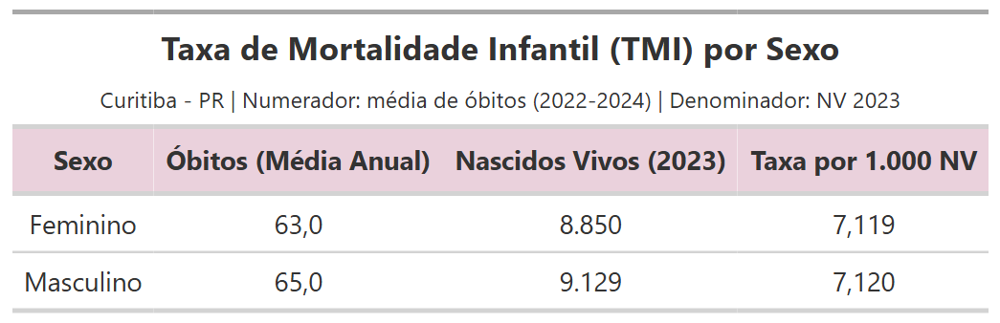
```

```{r, echo=FALSE, out.width="75%", fig.align="center"}
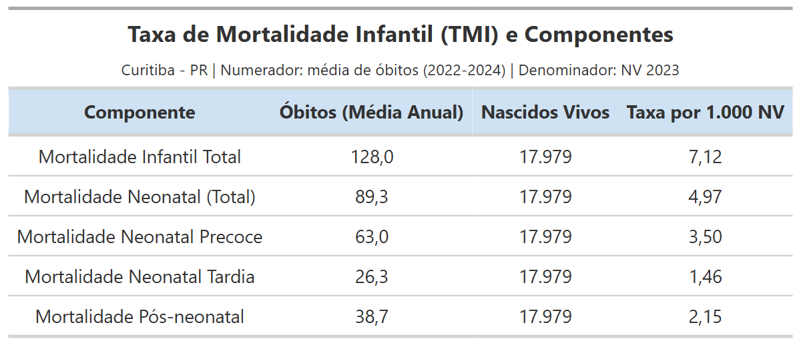
```

```{r, echo=FALSE, out.width="75%", fig.align="center"}
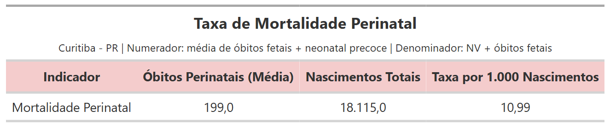
```


c\) Compare a estrutura de mortalidade por causas entre 2010, 2021 e 2024. Utilize 20 grupos de causas mais frequentes, segundo os grupos do CID-10 (ver Tabnet - Datasus), por sexo, e grupos de idade (\<5; 5 a 14; 15-39; 40-59; 60 e +) para os anos selecionados. Comente os resultados. Destacar a mortalidade por Covid-19 (CID B34.2).

**Resposta:**

```{r, echo=FALSE, out.width="100%", fig.align="center"}
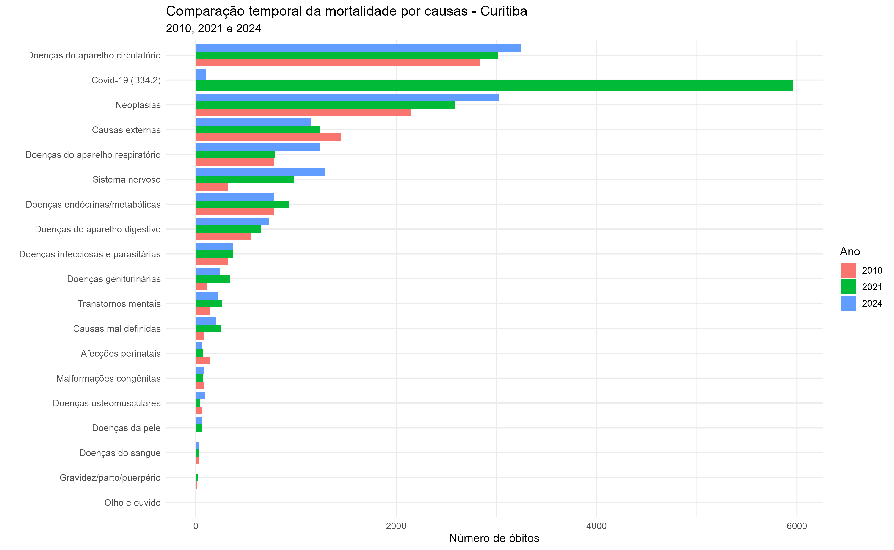
```

```{r, echo=FALSE, fig.align="center"}
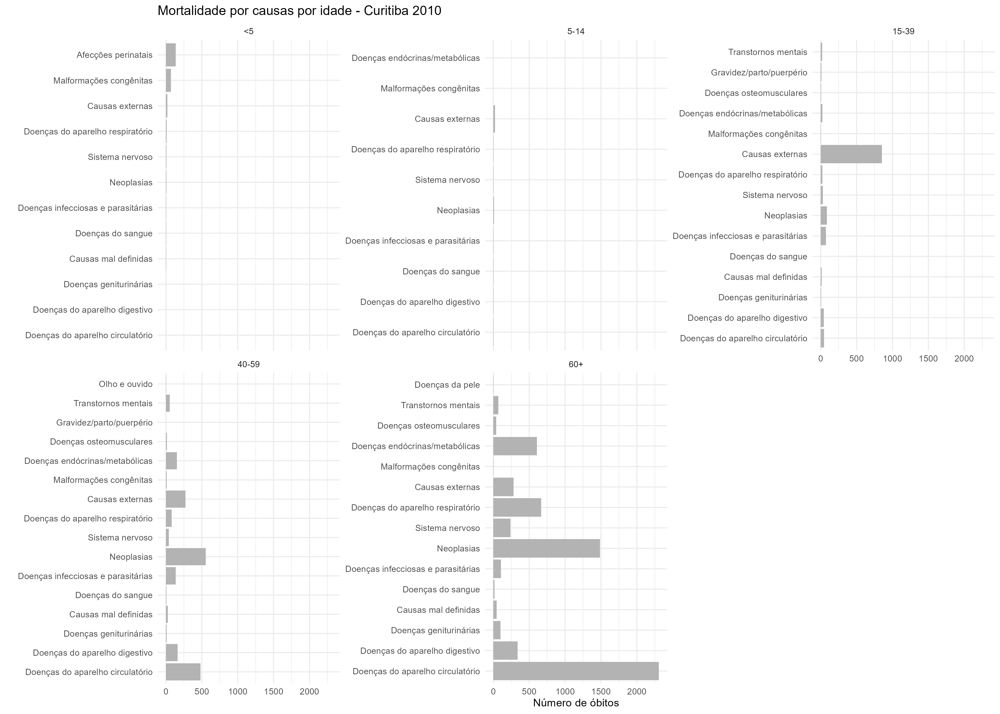
```

```{r, echo=FALSE, fig.align="center"}
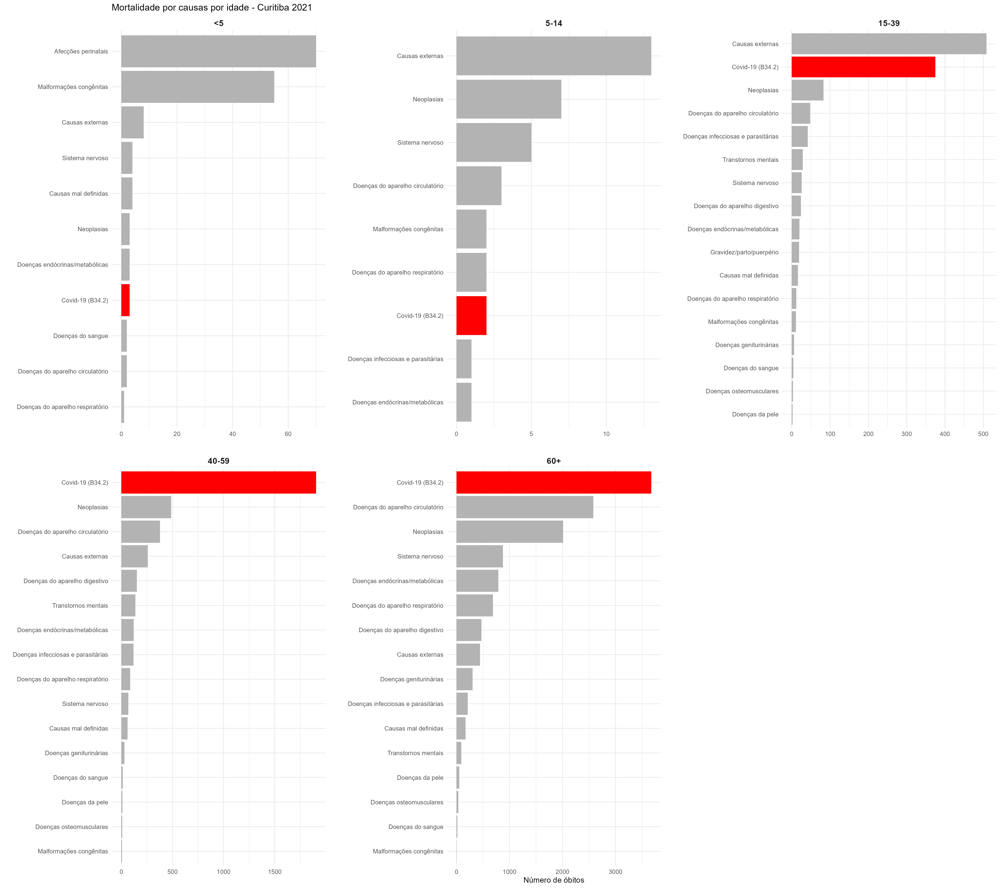
```

```{r, echo=FALSE, fig.align="center"}
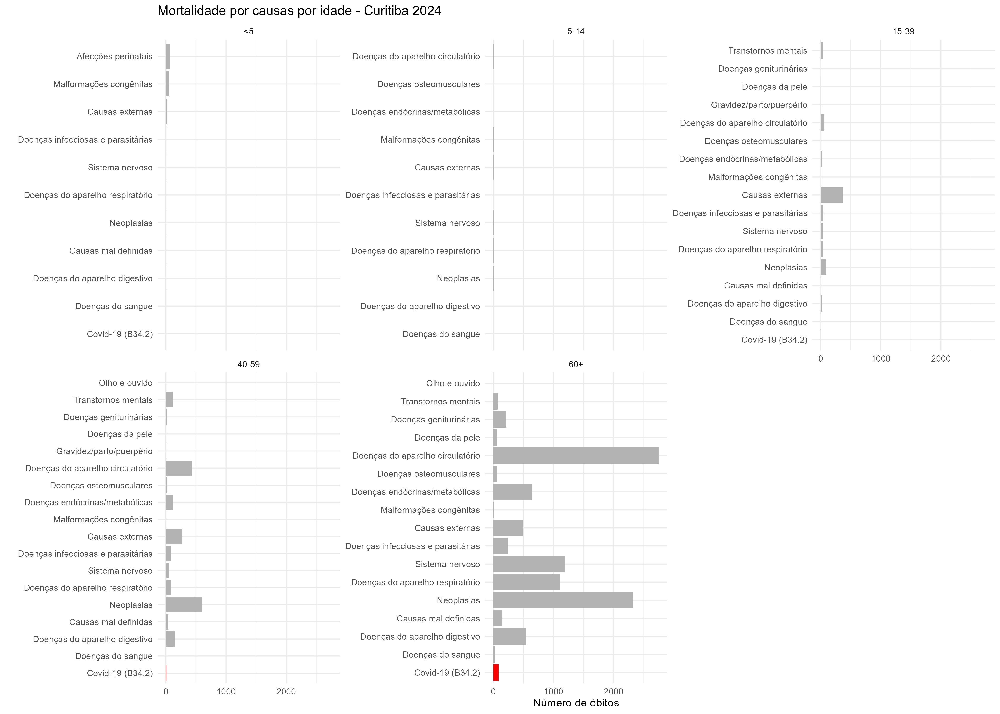
```

```{r, echo=FALSE, fig.align="center"}
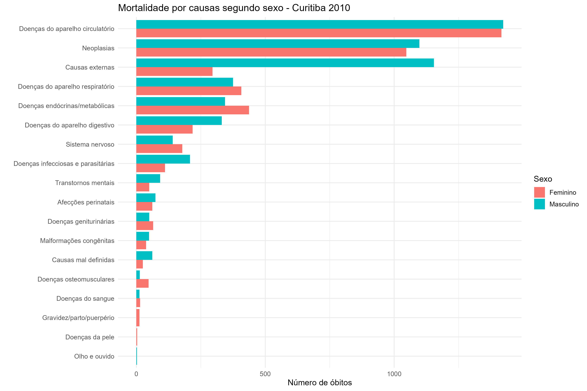
```

```{r, echo=FALSE, fig.align="center"}
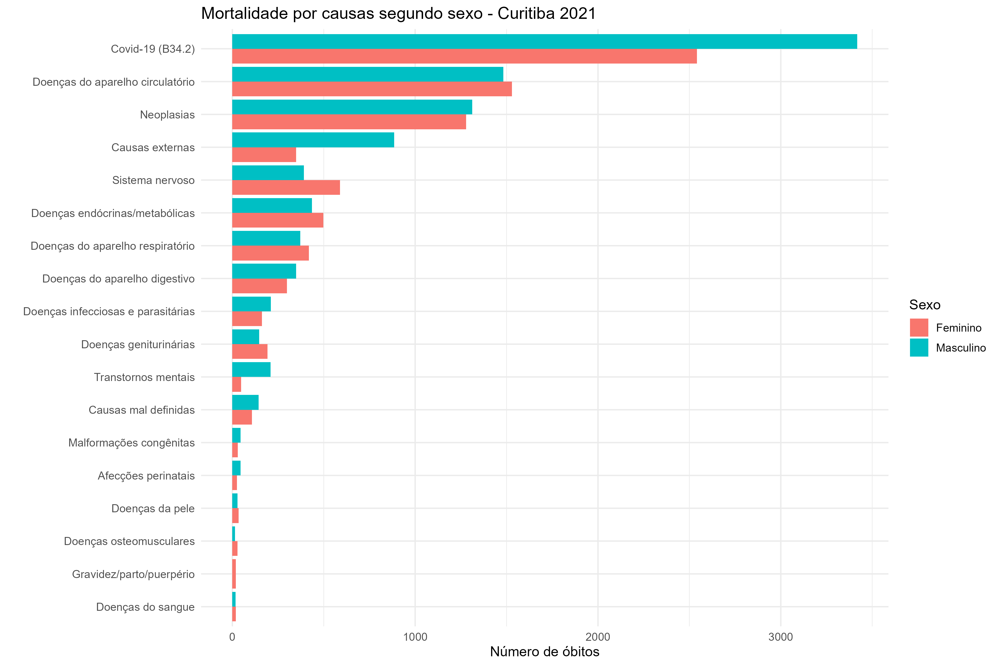
```

```{r, echo=FALSE, fig.align="center"}
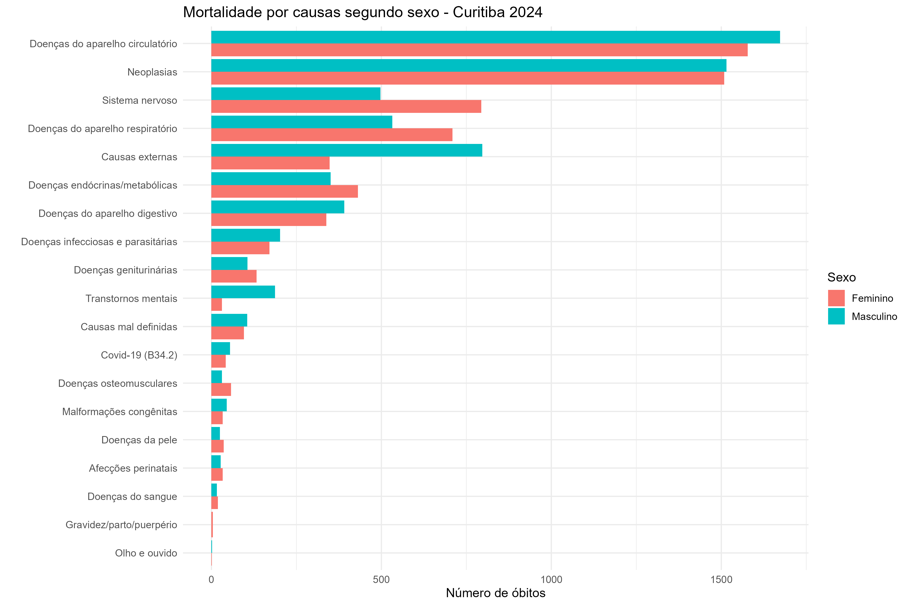
```

A estrutura de mortalidade em Curitiba apresenta, nos 3 anos observados, um predomínio de doenças crônicas não transmissíveis, mas que sofreu um rompimento em 2021 devido à pandemia de Covid-19. Os dados mostram que as doenças do aparelho circulatório e as neoplasias lideram consistentemente o volume de óbitos na população geral e na faixa de 60 anos ou mais, enquanto as causas externas — como acidentes e violência — exercem um impacto maior sobre o sexo masculino e a população jovem (15 a 39 anos). No entanto, em 2021, a Covid-19 subverteu essa distribuição, sendo a principal causa de mortalidade em Curitiba, registrando um volume de óbitos que praticamente duplicou em relação às causas de morte predominantes anteriormente e afetando de forma mais acentuada os homens em idade adulta.

  Ao analisar o comportamento por subgrupos, a Covid-19 revelou impactos diferentes a depender da idade e do sexo, poupando quase por completo os perfis infantis, cujos óbitos permaneceram concentrados em afecções perinatais e malformações congênitas para menores de 5 anos e em causas externas e neoplasias para a faixa de 5 a 14 anos. Em contrapartida, a população adulta de 40 a 59 anos e, especialmente, os idosos acima de 60 anos concentraram a maior mortalidade da pandemia em termos absolutos. Por gênero, as disparidades se evidenciaram não apenas na maior letalidade do vírus entre os homens, mas também na persistência da sobremortalidade masculina por causas externas em todos os períodos analisados.

  Por fim, o cenário observado em 2024 consolida o sucesso das estratégias de controle epidemiológico e da campanha de vacinação, demonstrando o recuo expressivo da Covid-19 e, consequentemente, a restauração da estrutura de mortalidade antes da pandemia. O retorno das doenças circulatórias e das neoplasias ao topo do ranking reflete a retomada do curso natural de transição demográfica da cidade, impulsionada pelo envelhecimento da população que eleva o número absoluto de óbitos por enfermidades crônicas em comparação a 2010. Assim, a comparação temporal evidencia que, apesar do trauma epidemiológico causado pela Covid-19 em 2021, o perfil de mortalidade de Curitiba recuperou sua previsibilidade estatística e a distribuição típica de regiões urbanas desenvolvidas.
  
  

d\) Construa Tábuas de Vida para cada sexo para a UF escolhida para 2010 e 2024, a partir das taxas específicas de mortalidade obtidas no item a:

-   Utilize a TMI obtida no item b. Lembre-se de que deve-se obter a TMI para cada sexo em separado.

-   Estime os fatores de separação para cada sexo, nas idades 0-1 e 1-4, com base nos microdados do SIM.

-   Compare os valores da função de esperança de vida para as idades exatas 0 e 60 com os obtidos no estudo do IBGE (Projeções) e no estudo GBD. Comente os resultados obtidos e o significado desses indicadores.

-   Com base na TV calculada, grafique as funções lx e nqx para cada sexo e comente os resultados.

-   Comente os resultados à luz de artigos recém publicados.

**Resposta:**

```{r, echo=FALSE, fig.align="center"}
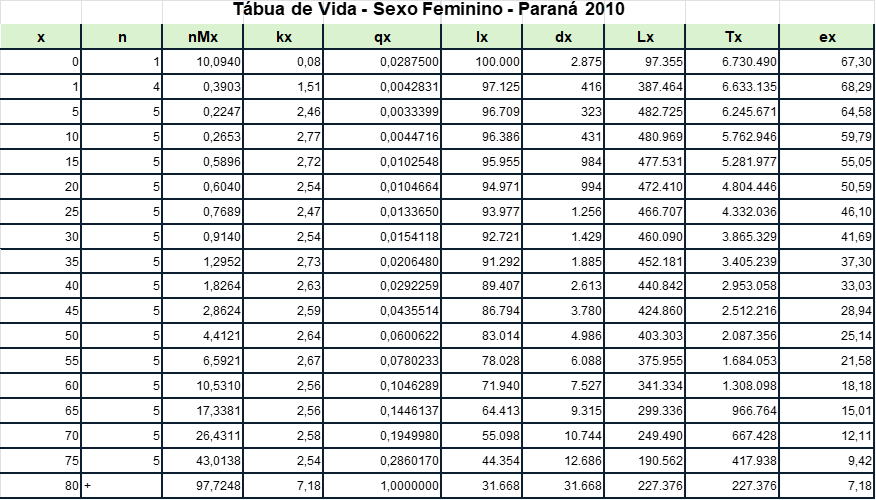
```

```{r, echo=FALSE, fig.align="center"}

```

```{r, echo=FALSE, fig.align="center"}
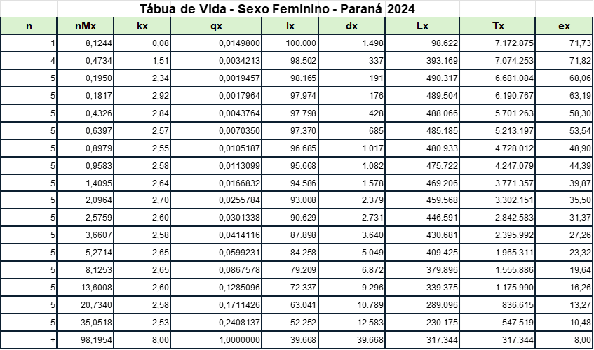
```

```{r, echo=FALSE, fig.align="center"}
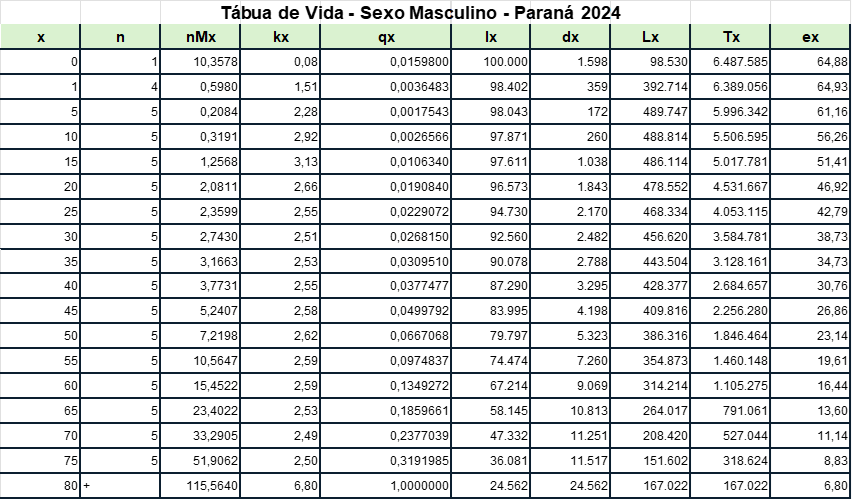
```
